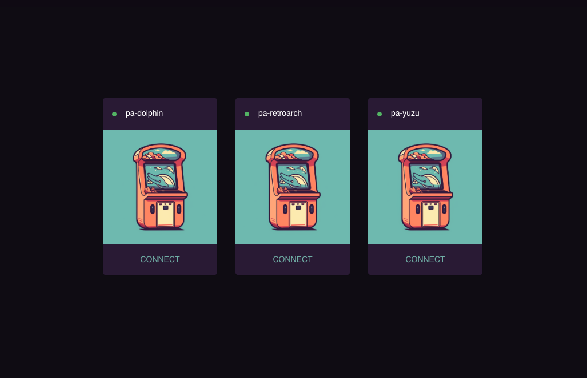
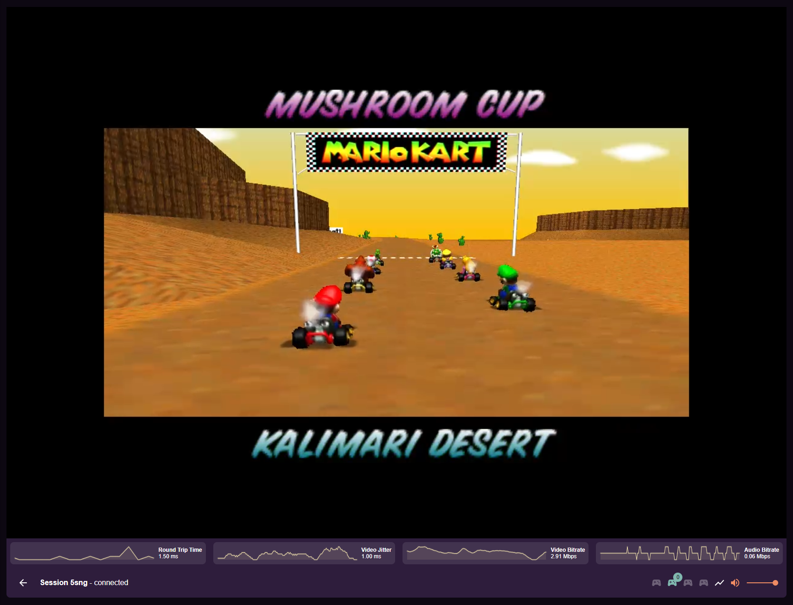
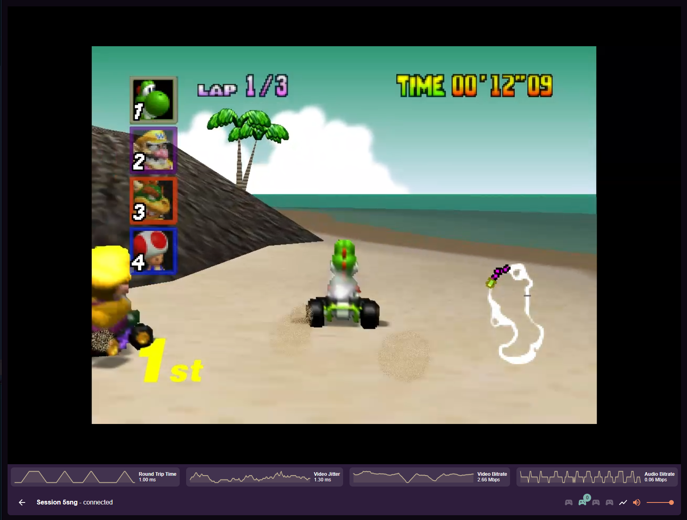
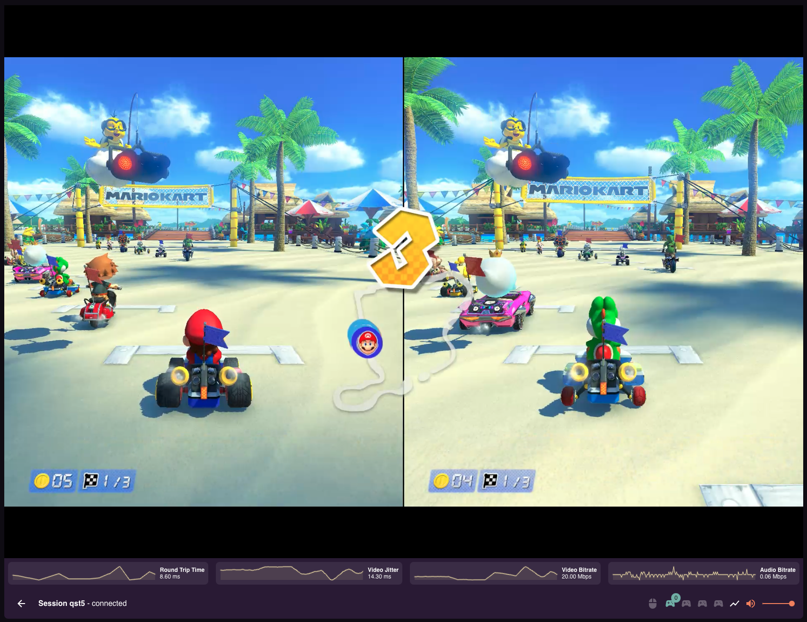
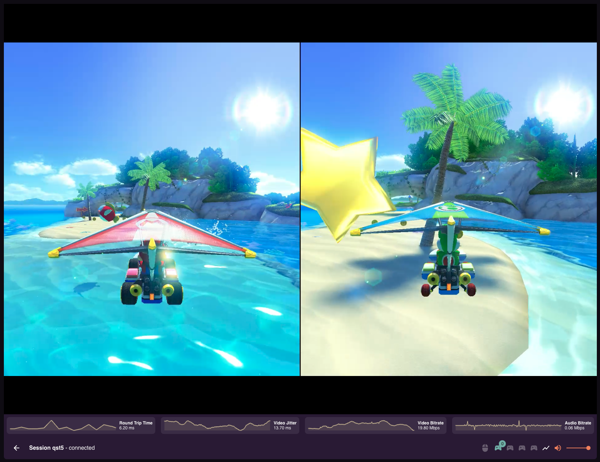

# Pod-Arcade: Kubernetes-Native Retro Game Streaming

***IMPORTANT NOTE: Pod-Arcade is still in early development. It is not yet ready for general use. We make no guarantees about the stability of each new build, and much of the documentation may be missing or incomplete.***

Play Retro Games with your friends, directly in your browser!

## Overview

Pod-Arcade is an open-source project that enables you to stream games via RetroArch or other compatible software, running on Wayland, directly to your web browser.

It is designed to be deployed on Kubernetes, but can also be deployed using Docker or any other container platform.

There are two major components to Pod-Arcade:

* The Pod-Arcade Server — an HTTP/MQTT server that manages the game streaming sessions. Desktops and web browsers connect to this server in order to stream games.

* The Pod-Arcade Desktop — a desktop application that runs on Wayland and streams games to the Pod-Arcade Server.

## Getting Started

If you just want to get something up and running quicky, you have a few different options.
If you're looking for a more permanent setup, be sure to visit the docs on our website: https://pod-arcade.com

### Helm

We provide some reference helm charts for deploying Pod-Arcade on Kubernetes, at [pod-arcade/charts](https://github.com/pod-arcade/charts). This is what we use to deploy Pod-Arcade during development, and is likely the easiest way to get started.

### Docker

#### Server
You should be able to connect using https://localhost:8443. You may need to accept the self-signed certificate.
If that doesn't work, you may need to generate your own certificate and key, add that to your trust store, mount it into the container, and set the `TLS_CERT` and `TLS_KEY` environment variables to the path you mounted them to. Alternatively, [chrome has a flag that will allow you to ignore invalid certificates on localhost](chrome://flags/#allow-insecure-localhost).

```bash
# Mapping ports: 
# - 1883 for MQTT (not needed, but useful for debugging)
# - 8080 for HTTP
# - 8443 for HTTPS (probably what your browser needs to connect to)
#
# Setting environment variables for authentication and configuration:
# - AUTH_REQUIRED: Enable authentication. If you set this to false, you can skip the PSK environment variables.
# - DESKTOP_PSK: Pre-shared key for desktop authentication
# - CLIENT_PSK: Pre-shared key for client (browser) connections
# - ICE_SERVERS: STUN server configuration for WebRTC. The browser will use this to find the best route to the desktop.
# - SERVE_TLS: Enable TLS (HTTPS)
#
docker run -it --rm --name pa-server \
  -p 1883:1883 \
  -p 8080:8080 \
  -p 8443:8443 \
  -e AUTH_REQUIRED="true" \
  -e DESKTOP_PSK="theMagicStringUsedToAuthenticateDesktops" \
  -e CLIENT_PSK="thePasswordUsersPutInToConnect" \
  -e ICE_SERVERS='[{"urls":["stun:stun.l.google.com:19302"]}]' \
  -e SERVE_TLS="true" \
 ghcr.io/pod-arcade/server:main
```

#### Client

The following example runs an "all-in-one" desktop image that bundles the desktop binary, and the yuzu emulator.

```bash
# Volume Mappings: 
# - /dev/dri:/host/dev/dri is to enable hardware acceleration
# - /dev/uinput:/host/dev/uinput is to enable gamepad support
#
# Setting environment variables for authentication and configuration:
# - MQTT_HOST: This is the URL of the Pod-Arcade server. It can be ws://host:8080/mqtt. If you're using TLS with a valid (not self-signed) certificate, it should be wss://host:8443/mqtt
# - DESKTOP_ID: This is the identifier for this desktop. It should be [a-z0-9-]+.
# - DESKTOP_PSK: Pre-shared key for desktop authentication. This should match the DESKTOP_PSK on the server.
#
docker run -it --rm --user 0 --privileged  \
  -e MQTT_HOST="ws://localhost:8080/mqtt" \
  -e DESKTOP_ID=example-yuzu \
  -e DESKTOP_PSK="theMagicStringUsedToAuthenticateDesktops" \
4  -v /dev/dri:/host/dev/dri \
  -v /dev/uinput:/host/dev/uinput \
 ghcr.io/pod-arcade/example-yuzu-aio:main
```

### Docker Compose

There's docker-compose for running desktops in [pod-arcade/example-apps](https://github.com/pod-arcade/example-apps)

## Screenshots

Heres some screenshots of Pod-Arcade in action:

### Homepage



### Gameplay









# License
Pod-Arcade is licensed under the MIT License - see the LICENSE file for details.
