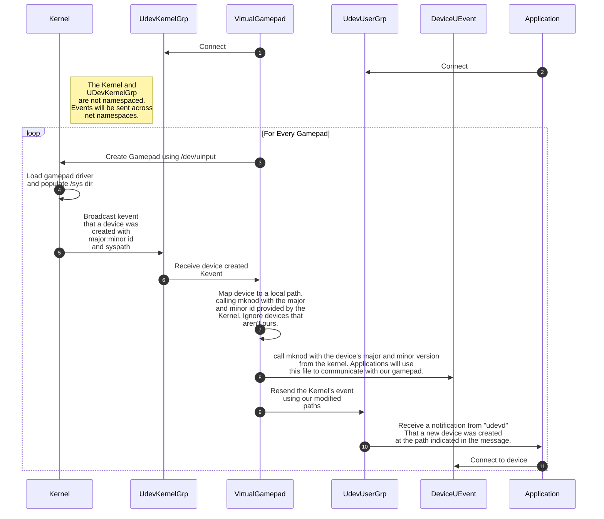

# Virtual-Gamepad

The purpose of this repo is to handle the creation of virtual gamepad devices inside of Docker, and expose them using the udev interface. Unfortunately, `uinput` and `udevd` aren't container aware, so we can only do so much to keep things isolated to containers. While we are able to control device visibility inside of our containers, we aren't able to prevent the host from seeing those virtual devices. As a result, it's recommended that you only use this on a server, not a workstation.

This code aims to utilize the same `uinput` and `udev` APIs to work with existing software for discovering these virtual gamepads.

## Basic Overview of Components


### 1. Connect

Our application starts up, and opens a connection to the Kernel. This connection will be used to receive events when devices are created. The reason we need this, is that we can't simply emit events directly without knowing the device information assigned by the Kernel. As far as I know, the only way of receiving this information is to listen for those Kevents sent by the kernel. Opening this socket looks like this:

```golang

// ...

const (
  KernelEvent Mode = 1
  UdevEvent Mode = 2
)

// ...

if c.Fd, err = syscall.Socket(syscall.AF_NETLINK, syscall.SOCK_RAW, syscall.NETLINK_KOBJECT_UEVENT); err != nil {
  return
}

c.Addr = syscall.SockaddrNetlink{
  Family: syscall.AF_NETLINK,
  Groups: uint32(mode), // Mode determines the group, Kernel or Udev
}

if err = syscall.Bind(c.Fd, &c.Addr); err != nil {
  syscall.Close(c.Fd)
}

// ...

```

Crucially, one other thing that we need to do is create the `/run/udev` directory, and create a `/run/udev/control` file. These files aren't used for anything, but the libudev library checks for the existence of these files to ensure that an instance of udev is running. It never reads to or writes to this file, only checks for its existence before subscribing to udev events.

### 2. Connect (Application Side)

Similar to how we subscribe to the Kernel group to receive device events over the netlink socket, applications normally subscribe to the Udev group.

Udevd is the userspace program that typically listens to these events from the kernel, enriches them with information from a hardware database, and re-emits them. It also has a set of rules that it executes when messages from the kernel match a set of filters. These rules can be used to do things like run a program that calibrates the joystick device, or other various things that don't have a direct subscription to Udev. Applications typically subscribe to this using `libudev`, which is a library used for interacting with the userspace daemon.

In our case, we're aiming to replace much of this userspace program's functionality. We have to do some trickery in order to get `libudev` to actually believe that there's a running udev instance and make the subscription. We do this by `touch`ing the `/run/udev/control` file.

### 3. Create a gamepad using /dev/uinput

The /dev/uinput interface serves as a user-space API for creating and managing input devices at the kernel level. In essence, it enables you to create virtual input devices such as keyboards, mice, joysticks, or gamepads that the operating system treats as actual hardware devices. In order to use this interface, we need to bind through the host's interface.

> **NOTE:** This isn't technically true. We can use mknod to recreate the /dev/uinput file, as long as we have the major:minor version supplied by the kernel, but mounting it through is the easiest way. `c10:223` is what the device was on my machine, but I'm not sure if it's the same for everyone. `stat --format="%t %T" /dev/uinput` should give you the device numbers **in hexadecimal format**

Regardless, by writing ioctl commands to this device, we can create a Virtual Gamepad.

### 4. Kernel — Load gamepad driver and populate /sys directory

The Kernel takes those ioctl commands, and loads the appropriate input driver. I'm not sure exactly how all of that happens, but it then creates the /sys directory entry for that device, in `/sys/devices/virtual/input/`. Unfortunately, this stage is **_NOT_** restricted to your container. The /sys entry is created in every container, and on the host. Additionally, the events emitted in the next step are also emitted to everyone. This means that if your host is running `udevd` (which it likely is), those virtual devices will show up on your host. We're investigating ways of preventing this, but for now... virtual devices created in your container will show up on the host as well.

### 5. Broadcast Kevent

When a device is connected, the kernel writes a message that looks something like this over the netlink socket we're subscribed to.
It's a series of strings that represents device information. It always begins with a header that sigals what the `ACTION` is and on what `DEVPATH` it occurs on.

```text
add@/class/input/input9/mouse2\0
ACTION=add\0
DEVPATH=/class/input/input9/mouse2\0
SUBSYSTEM=input\0
SEQNUM=1064\0
PHYSDEVPATH=/devices/pci0000:00/0000:00:1d.1/usb2/2­2/2­2:1.0\0
PHYSDEVBUS=usb\0
PHYSDEVDRIVER=usbhid\0
MAJOR=13\0
MINOR=34\0
```

### 6. Receive device created Kevent

Our application receives and parses the message sent from the kernel. This gets it ready for step 7.

### 7. Map device to a local path

Now that we have the device major and minor number, we can map this to a file in our container. When determining if we should process a message from the given `<DEVNAME>`, we compare it to the syspath queried using `ioctl` for our gamepad.

Because we may have multiple containers, the event for one of our virtual gamepads may come in looking like: `add@/devices/virtual/input/input378/js4`. Unfortunately, some legacy applications don't look for gamepad devices beyond `js0-3`. This isn't as much of a problem with programs that use the new `libevdev` devices, but for older ones, they won't detect the newly plugged in gamepad. Instead, we map this js4 device back to js0 for our container. This doesn't affect the path assigned by the Kernel, but any further events emitted from our application will now use the mapped `js0-3`.

Additionally, we need to map not just the legacy `jsX` devices, but also the `eventXYZ` devices. If it's the `eventXYZ`, we don't make any changes and map the device as is.

If we find a match, we know that the device belongs to us. If it's a legacy `jsX` device, we'll map it to it's index in our gamepad hub. Both of these devices are mapped to `/dev/input/js0-3`, or `/dev/input/eventXYZ`.

### 8. Call mknod with the device's major and minor version

Once we've mapped it to the desired path, we'll make syscalls equivalent to `mknod c <major> <minor> /dev/input/jsX` and `mknod c <major> <minor> /dev/input/eventXYZ`.

### 9. Resend the Kernel's event as a Udev event

After we create the local device path using mknod, we can modify and resend the events using the udev format. This is an internal format used only by udevd and libudev. The format of this additional message looks something like this:

```c
// C code taken from device-monitor.c

typedef struct monitor_netlink_header {
        /* "libudev" prefix to distinguish libudev and kernel messages */
        char prefix[8];
        /* Magic to protect against daemon <-> Library message format mismatch
         * Used in the kernel from socket filter rules; needs to be stored in network order */
        unsigned magic;
        /* Total length of header structure known to the sender */
        unsigned header_size;
        /* Properties string buffer */
        unsigned properties_off;
        unsigned properties_len;
        /* Hashes of primary device properties strings, to let libudev subscribers
         * use in-kernel socket filters; values need to be stored in network order */
        unsigned filter_subsystem_hash;
        unsigned filter_devtype_hash;
        unsigned filter_tag_bloom_hi;
        unsigned filter_tag_bloom_lo;
} monitor_netlink_header;
```

```text
8 bytes of "libudev"
4 bytes of 0xfeedcafe
4 bytes of header size
X bytes of header
ACTION=add\0
DEVPATH=/class/input/input9/mouse2\0
SUBSYSTEM=input\0
SEQNUM=1064\0
PHYSDEVPATH=/devices/pci0000:00/0000:00:1d.1/usb2/2­2/2­2:1.0\0
PHYSDEVBUS=usb\0
PHYSDEVDRIVER=usbhid\0
MAJOR=13\0
MINOR=34\0
```

### 10. Application Receives a notification from "udevd"

Now that we've forged our udev message, the application subscribed should receive it, and treat it as though it was a real message emitted from udevd.

### 11. Application opens virtual device

From the DEVPATH extracted from the received message, the corresponding `libevdev` or legacy uapi `joystick` library. Once connected to that device, the application should be able to use it as normal.

## Helpful References

https://documentation.suse.com/sles/12-SP5/html/SLES-all/cha-udev.html

https://insujang.github.io/2018-11-27/udev-device-manager-for-the-linux-kernel-in-userspace/

https://github.com/systemd/systemd/blob/main/src/libudev/libudev-monitor.c

https://github.com/pilebones/go-udev

https://docs.voidlinux.org/config/session-management.html

https://www.freedesktop.org/wiki/Software/systemd/multiseat/